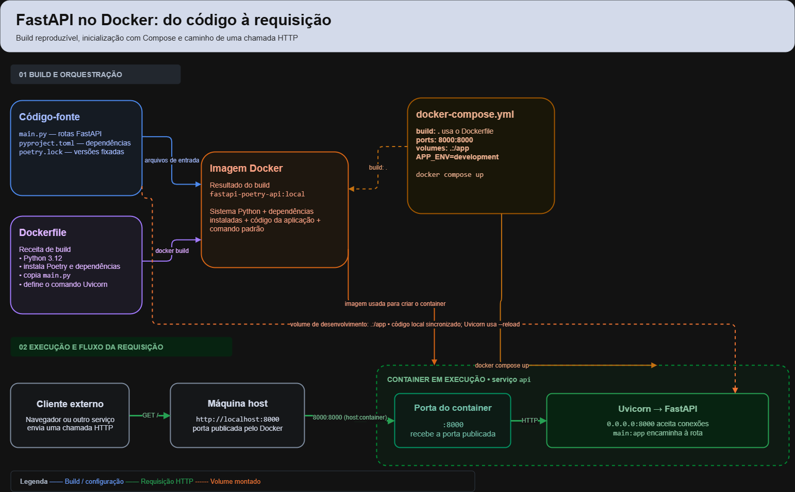

# FastAPI com Docker, Compose e Poetry

Exemplo mínimo para executar uma API FastAPI em um container. O Poetry instala as dependências durante o build, e o volume do Compose sincroniza os arquivos locais para que o Uvicorn recarregue a aplicação durante o desenvolvimento.

## Pré-requisitos

- Docker Engine/Desktop iniciado
- Docker Compose (plugin `docker compose` ou comando legado `docker-compose`)

Não é necessário instalar Python ou Poetry na máquina host.

## Executar

Clone o repositório e entre na pasta do projeto:

```bash
git clone https://github.com/Danielmsouza-dev/fastapi-docker-poetry.git
cd fastapi-docker-poetry
```

Construa a imagem e inicie o serviço em segundo plano:

```bash
docker-compose up --build -d
```

Se sua instalação usa o plugin Compose, o comando equivalente é:

```bash
docker compose up --build -d
```

A API ficará disponível em <http://localhost:8000>. A documentação interativa fica em <http://localhost:8000/docs> e a verificação de saúde em <http://localhost:8000/health>.

Para acompanhar os logs:

```bash
docker-compose logs -f api
```

Para parar e remover o container:

```bash
docker-compose down
```

Use `docker compose` em vez de `docker-compose` se estiver usando o plugin Compose.

## Desenvolvimento

O Compose monta a pasta do projeto em `/app` e inicia o Uvicorn com `--reload`. Salvar alterações em `main.py` atualiza a aplicação automaticamente. A porta `8000` do host é encaminhada à porta `8000` do container.

O `Dockerfile` instala uma versão fixada do Poetry, desativa ambientes virtuais dentro do container e usa `poetry install --only main --no-root` para instalar as dependências descritas no `pyproject.toml`. O `poetry.lock` fixa também as versões transitivas. Para atualizar as dependências, instale Poetry localmente, execute `poetry lock` e versione o arquivo atualizado.

## Verificação automatizada

O GitHub Actions constrói a imagem com Docker Compose, inicia a API e verifica as rotas `/` e `/health` a cada envio para a branch `main` e em pull requests direcionados a ela. Os logs do workflow mostram o resultado do teste.

## Diagrama da containerização



O arquivo editável do diagrama é [`diagrama-containerizacao.drawio`](./diagrama-containerizacao.drawio).

### Como as peças se conectam

1. **Código e Dockerfile:** `main.py` contém as rotas da API; `pyproject.toml` e `poetry.lock` descrevem e fixam as dependências. O Dockerfile define a imagem base Python, instala o Poetry e as dependências, copia o código e configura o comando do Uvicorn.
2. **Imagem Docker:** `docker compose up --build` usa `build: .` para construir a imagem a partir do contexto do projeto e do Dockerfile. A imagem reúne o ambiente e a aplicação, mas ainda não é um processo em execução.
3. **Compose e container:** o `docker-compose.yml` declara como construir e iniciar o serviço `api`, suas variáveis de ambiente, o volume e as portas. O container é a instância da imagem em execução.
4. **Volume de desenvolvimento:** `.:/app` monta a pasta do projeto no diretório `/app` do container. Assim, alterações locais em `main.py` ficam visíveis para o Uvicorn com `--reload`; as dependências instaladas na imagem permanecem disponíveis.
5. **Caminho da requisição:** o cliente acessa `http://localhost:8000`. O mapeamento `8000:8000` encaminha a porta 8000 do host à porta 8000 do container. O Uvicorn escuta em `0.0.0.0:8000` e encaminha a chamada à aplicação FastAPI.

As setas azuis e roxas representam os insumos do build; as laranjas mostram a imagem e as configurações que iniciam o container; a seta tracejada laranja representa o volume; e as setas verdes acompanham a requisição HTTP até a aplicação.

## Estrutura

```text
.
├── Dockerfile
├── .gitignore
├── .dockerignore
├── .github/workflows/ci.yml
├── docker-compose.yml
├── diagrama-containerizacao.drawio
├── diagrama-containerizacao.png
├── main.py
├── poetry.lock
└── pyproject.toml
```
